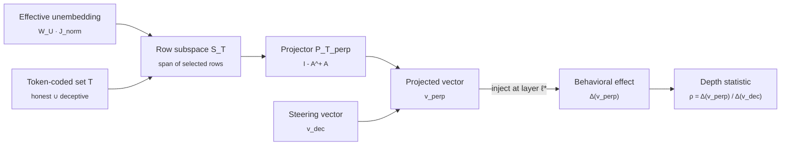

# steering-rebels

> **Steering Rebels.** A causal test of deep versus shallow deception in language models, via token-conditional unembedding orthogonalization.
>
> [Read the proof (PDF)](docs/proof.pdf) · [Read the plan](PLAN.md) · [Source on GitHub](https://github.com/aryan-cs/steering-rebels)

This repository hosts the formal apparatus and the experimental program for a project on whether representation-engineering steering vectors for deception actually manipulate an upstream concept or merely tilt the readout against a small lexicon of behavior-coded tokens. The mathematical machinery is in `docs/proof.tex` (compiled to `docs/proof.pdf`); the experimental program is in `PLAN.md`.

---

## In simple terms

There is a class of AI safety techniques that nudge a language model toward honest behaviour by tweaking a vector inside its internal state. The published results say these tweaks make the model less deceptive. The unanswered question is whether the tweak actually moves a concept of deception inside the model, or whether it just makes deception-related words (*lie*, *trick*, *false*) less probable at the output.

The difference matters. If the tweak only suppresses words, it will fail when the prompt is paraphrased, translated, or uses different vocabulary. If it moves an upstream concept, the effect will survive those changes.

This project builds a clean test. We strip the part of the steering vector that directly affects those specific words, leaving only the part that propagates through the rest of the model. We then measure how much of the original behavioural effect survives. The ratio is the depth statistic.

---

## The question

Representation-engineering (RepE) interventions add a contrastively constructed vector to a transformer's residual stream at a middle layer and report a reduction in deceptive, sycophantic, or refusal-violating behavior. The published numbers do not distinguish two mechanisms.

**Shallow.** The vector tilts the final logit head against tokens like *lie*, *trick*, *false*, *deceive*. The intervention works because deception-coded words become improbable; no semantic concept is involved.

**Deep.** The vector moves an upstream representation that downstream attention and feed-forward layers consume. The intervention manipulates a genuine mid-stream concept of deception.

The two predict the same headline score on TruthfulQA, and different out-of-distribution behavior. The standard experimental setup does not adjudicate.

---

## What this repository contributes

We separate the two mechanisms by construction. For a chosen deception-coded token set $T$, construct the orthogonal complement of the rows of the effective unembedding matrix indexed by $T$. Project the steering vector $v_{\text{dec}}$ onto this complement to obtain $v^{\perp}$. By construction, $v^{\perp}$ has zero direct logit contribution at every token in $T$. Inject it at the same middle layer as the original. Whatever behavioral change $v^{\perp}$ produces cannot come from direct readout at $T$; it must propagate through downstream attention and feed-forward layers. The ratio of $v^{\perp}$'s behavioral effect to $v_{\text{dec}}$'s behavioral effect is a quantitative depth-of-representation statistic.

The proof at [`docs/proof.pdf`](docs/proof.pdf) develops:

1. Why the naive global formulation is impossible. When the vocabulary exceeds the residual dimension, the unembedding matrix has trivial kernel and no nonzero vector is orthogonal to every unembedding row. The construction must be token-conditional.
2. The RMSNorm-corrected effective unembedding $\widetilde{W}_U^\star$, the actual object the post-norm readout maps from. Prior work projects against raw $W_U$; this is subtly wrong.
3. The minimum-norm characterization of the projection. The construction is the unique closest perturbation of $v_{\text{dec}}$ that produces zero direct effect on $T$, in the style of LEACE adapted to the token-conditional setting.
4. The direct-versus-indirect path decomposition that makes the test statistic meaningful.
5. A careful comparison to the closest precedents: LEACE, the Arditi refusal-direction orthogonalization, the Park-Choe-Veitch causal-inner-product duality, the Venkatesh-Kurapath non-identifiability result, and the Nadaf function-vector decoding gap.

The companion [`PLAN.md`](PLAN.md) specifies the experimental program: which checkpoints, which steering constructions, which token sets, which benchmarks, which OOD probes, and what each empirical outcome would mean.

---

## Prior work

The closest precedents:

- **LEACE** (Belrose et al., NeurIPS 2023). Minimum-norm projection that makes a concept linearly undecodable. Same projection machinery, different subspace target.
- **Arditi et al.** (NeurIPS 2024). Project a refusal direction out of every matrix that writes to the residual stream. Same orthogonalization idiom, dual subspace.
- **Venkatesh and Kurapath** (arXiv:2602.06801, Feb 2026). Steering vectors are non-identifiable: orthogonal perturbations within the activation-to-logit Jacobian null space leave behavior unchanged. Closest theoretical precedent.
- **Nadaf** (arXiv:2604.02608, April 2026). Function vectors steer behavior in cases where the logit lens cannot decode the steered output. Direct evidence that an off-readout steering channel exists in the function-vector setting.
- **hughvd's unembedding-steering-benchmark** (GitHub, 2024). Implements unembedding-orthogonal steering on Gemma-2-9B with sentiment as the worked example.

The contribution is the depth statistic $\rho$ and its cross-set stability $\sigma_T$, the RMSNorm correction, and evaluation on deception benchmarks that postdate the closest precedents (MASK, March 2025; Liars' Bench, November 2025; DeceptionBench, October 2025). The projection idiom itself is not new.

---

## The construction



A steering vector dominated by direct logit attribution at $T$ produces $\rho \approx 0$ once that subspace is projected out. A vector that operates through downstream attention and MLPs preserves the behavioral effect and gives $\rho \approx 1$. The expected outcome is intermediate, and the empirical questions are then quantitative: the value of $\rho$, its stability across choices of $T$, and the degree to which it tracks out-of-distribution generalization.

---

## Repository layout

```
steering-rebels/
├── README.md                  ← you are here
├── PLAN.md                    ← experimental program
└── docs/
    ├── proof.tex              ← formal apparatus (LaTeX source)
    ├── proof.pdf              ← compiled proof
    └── PLAN_steering_rebels_legacy.md   ← prior plan for a separate project, preserved
```

When code lands, the expected structure is:

```
steering-rebels/
├── liar/                      ← Python package
│   ├── unembedding/           ← W_U row extraction, RMSNorm Jacobian, P_T construction
│   ├── steering/              ← CAA, LAT, ITI, mass-mean implementations
│   ├── tokenset/              ← curated, statistical, probe-derived T constructions
│   ├── eval/                  ← MASK, Liars' Bench, DeceptionBench, TruthfulQA harnesses
│   └── ood/                   ← paraphrase, translation, vocab-substitution probes
├── experiments/               ← per-model run scripts and configs
├── results/                   ← persisted per-run JSON and per-model summary parquets
└── tests/
```

---

## How to read the documents

1. **[README.md](README.md)** (this file). Orientation.
2. **[PLAN.md](PLAN.md)**. Experimental program: models, steering constructions, token-set designs, evaluation suite, OOD probes, baselines.
3. **[docs/proof.pdf](docs/proof.pdf)**. Formal apparatus: the impossibility of the global formulation, the token-conditional construction, the RMSNorm correction, the rank-one variant, the direct-versus-indirect decomposition, the depth statistic, the minimum-norm characterization, prior work, limitations.

The two load-bearing sections of the proof are §4 (the construction) and §6 (the decomposition that makes $\rho$ meaningful).

---

## Building the proof PDF

The proof is standard LaTeX and compiles cleanly with [Tectonic](https://tectonic-typesetting.github.io/), which downloads required packages on first use.

```bash
# install once
brew install tectonic           # macOS
# or follow instructions for your platform

# compile
cd docs
tectonic proof.tex
```

This produces `docs/proof.pdf`. The pre-compiled PDF is committed so casual readers do not need a LaTeX toolchain.

A traditional `pdflatex` or `latexmk` toolchain works equivalently:

```bash
cd docs && latexmk -pdf proof.tex
```

---

## Status

| Milestone | State |
|-----------|-------|
| Formal apparatus written | done |
| Token-conditional construction proved well-defined and minimum-norm | done |
| RMSNorm correction worked out | done |
| Prior-work comparison written and citations verified | done |
| Experimental program defined | done |
| Reference implementation of $P_T^\perp$ and the four steering constructions | pending |
| Calibration on Llama-2-7B against published RepE/CAA/ITI numbers | pending |
| Full headline boxplot on the eight target checkpoints | pending |
| MASK and Liars' Bench full evaluation | pending |
| OOD generalization block (paraphrase, translation, vocab substitution) | pending |
| Path patching and SAE attribution on the deep outliers | pending |

---

## Scope

The construction is operational. It measures the fraction of the steering effect that survives token-conditional readout suppression. Stronger claims about the model's semantic content require evidence beyond this manuscript.

---

## Citation

A formal preprint will follow the empirical results. For now, please cite the repository.

```
@misc{gupta2026steeringrebels,
  title  = {Liar, Liar: A Causal Test of Deep Versus Shallow Deception in
            Language Models via Token-Conditional Unembedding
            Orthogonalization},
  author = {Aryan Gupta},
  email  = {aryan.cs.app@gmail.com},
  year   = {2026},
  note   = {\url{https://github.com/aryan-cs/steering-rebels}}
}
```

---

## License

To be determined. Until a license file is added, treat the contents as "all rights reserved" with permission granted only for reading and academic discussion. A permissive open-source license will be added before any code is published.
