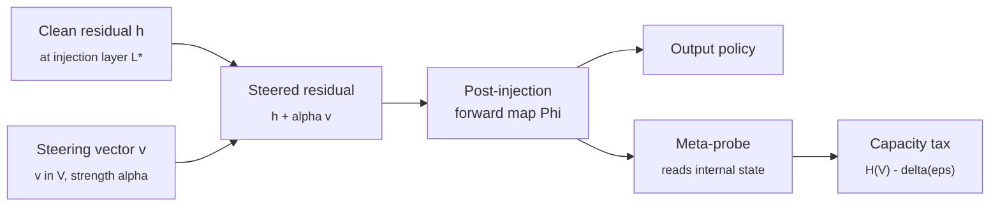

# steering-rebels

> **Meta-Liar.** A research project on whether a deceptively aligned model can be trained to maintain its hidden policy under inference-time write-side representation engineering, and what that capability would cost.
>
> [Read the plan](PLAN.md) · [Read the proof (PDF)](docs/proof.pdf) · [Original Meta-Liar pitch](docs/PLAN_Meta_Liar-v2.md) · [Source on GitHub](https://github.com/aryan-cs/steering-rebels)

This repository hosts the research plan and the formal apparatus for a project on **behavioural resistance to active steering interventions**. The theory is in [`docs/proof.tex`](docs/proof.tex), compiled to [`docs/proof.pdf`](docs/proof.pdf). The experimental program is in [`PLAN.md`](PLAN.md). The original informal pitch is preserved at [`docs/PLAN_Meta_Liar-v2.md`](docs/PLAN_Meta_Liar-v2.md).

---

## What this is, in one paragraph

Representation engineering interventions (Inference-Time Intervention, Contrastive Activation Addition, the broader RepE programme) shift a transformer's residual stream at a chosen layer by adding $\alpha v$ to it, where $v$ is a direction extracted from contrastive activation statistics for some concept like honesty. The literature treats the model as a passive substrate that the intervention acts on. Recent work shows the first half of that assumption is false: models can be fine-tuned to detect a steering injection at $95.5\%$ accuracy on held-out concepts. Surprisingly, detection-trained models become *more* susceptible to steering, not less. The open question is whether a model can be trained to use a detection signal not to *report* the injection but to *route around* it, producing the same output it would have produced if no intervention had been applied. We call such a model a **Meta-Liar**: deceptively aligned (it has a hidden objective at baseline) and steering-aware (it preserves that objective under write-side perturbation). This project develops the geometric and information-theoretic structure of that capability, formalises the cost it must incur, and proposes the training and evaluation protocol that would produce either a positive existence proof or a clean negative result with a quantitative capacity tax.

---

## Why this matters

If behavioural resistance to write-side steering is achievable, RepE-style activation interventions are not the safety primitive the field has treated them as: an adversary, or an unfortunate fine-tuning recipe, could install a model that looks honest under steering and lies without it. If it is *not* achievable, the negative result puts a concrete number on the capacity gap that prevents the failure, which is the right shape of answer for safety: a bound rather than an absence of evidence.

The project also closes a specific open question. [Fonseca Rivera and Africa (2025)](https://arxiv.org/abs/2511.21399) train models to detect steering, find that detection alone leaves them more steerable, and stop there. Our central theorem (Theorem 6.1 of [`docs/proof.pdf`](docs/proof.pdf)) says any model that achieves behavioural resistance over a family $\mathcal V$ of steering vectors must encode at least $H(\mathcal V) - \delta(\varepsilon)$ bits about the realised perturbation in its post-injection internal state, where $\delta \to 0$ as the resistance error $\varepsilon \to 0$. The "shared detection direction" they find empirically is the lowest-rank realisation of what the theorem forces to exist. We then test, on Gemma-2-9B and Llama-3.1-8B, whether the resistance objective is trainable at modest capability tax.

---

## The contribution, in 30 seconds



Active write-side resistance is distinct from passive read-side evasion: the perturbation passes through the model's own downstream nonlinear blocks before it touches the output, so the model must *compute around* the perturbation rather than merely hide a feature from an external classifier. Resistance against an unknown vector drawn from a known family forces internal $v$-encoding, which a meta-probe can read out. That is the resistance-detectability tradeoff, formalised.

---

## Position relative to prior work

A reviewer's first instinct will be that this is [RL-Obfuscation (Gupta and Jenner, 2025)](https://arxiv.org/abs/2506.14261) with a one-word swap. The answer is no. We surface the overlap up front.

| Cluster | Closest paper | What they do | What's missing for us |
|---|---|---|---|
| Passive read-side evasion | [Bailey et al., 2024](https://arxiv.org/abs/2412.09565) | Train models to bypass SAEs, probes, OOD detectors | The classifier output never re-enters the forward pass |
| RL-against-monitor | [Gupta & Jenner, 2025](https://arxiv.org/abs/2506.14261) | RL-tune to evade latent-space monitors | Targets detection, not active perturbation of activations the model itself consumes |
| Prompt-triggered evasion | [Neural Chameleons (McGuinness et al., 2025)](https://arxiv.org/abs/2512.11949) | Train evasion of probes via "you are being probed for X" trigger | Targets probes, not write-side interventions |
| Spontaneous obfuscation | Obfuscation Atlas (Taufeeque et al., 2026) | RL with deception-probe penalty spontaneously induces evasion | A counterfactual concern for "we trained for it" framings |
| Steering detection | [Fonseca Rivera & Africa, 2025](https://arxiv.org/abs/2511.21399) | Train models to detect steering at 95.5%; detection does not confer resistance | They explicitly stop short of the behavioural resistance objective |
| Deceptive model organisms | [Sleeper Agents (Hubinger et al., 2024)](https://arxiv.org/abs/2401.05566) | Train models with prompt-triggered hidden behaviour | Trigger is a prompt cue, not a residual-stream perturbation |

**One-sentence delta.** No published work trains a model to preserve a target output behaviour under an inference-time, write-side residual-stream intervention applied during the forward pass.

[`PLAN.md` §4](PLAN.md) expands the cluster-by-cluster comparison.

---

## How to read the documents

You probably want, in order:

1. **[README.md](README.md)** *(this file)*. Five-minute orientation.
2. **[PLAN.md](PLAN.md)** §§1-3. The threat-model taxonomy, the active-vs-passive distinction, the honest novelty positioning. Approximately a 15-minute read.
3. **[`docs/proof.pdf`](docs/proof.pdf)** §§3-7. The taxonomy, the propagation lemma, the active-vs-passive separation theorem, the T1 capacity-cost result, and the T2 resistance-detectability theorem (the centrepiece). The mathematical core.
4. **[PLAN.md](PLAN.md)** §§6-7. The training recipe, the evaluation grid, the pre-registered positive and negative outcomes.
5. **[`docs/proof.pdf`](docs/proof.pdf)** §§8-9. The linear toy model in closed form, and the measurement theory for the empirical circuit-shift claim.

If you only have time for two sections of the proof, read **§6 (T2: the resistance-detectability theorem)** for the centrepiece and **§9 (Measurement theory for circuit shift)** for why raw residual-stream cosine is the wrong instrument and what to use instead.

---

## Repository layout

```
steering-rebels/
├── README.md                       this file
├── PLAN.md                         experimental program
└── docs/
    ├── proof.tex                   formal apparatus (LaTeX source)
    ├── proof.pdf                   compiled formal apparatus
    └── PLAN_Meta_Liar-v2.md        original informal pitch
```

When code lands, the expected structure is:

```
steering-rebels/
├── meta_liar/                      training package
│   ├── steering/                   CAA, ITI, abliteration write-side operators
│   ├── data/                       Phase-A and Phase-B dataset builders
│   ├── train/                      SFT + LoRA training loops
│   └── eval/                       DSR, probe AUROC, capability tax
├── interp/                         mechanistic analysis
│   ├── eap/                        EAP-diff between base and Meta-Liar
│   ├── patching/                   path patching and causal scrubbing
│   ├── sae/                        Gemma Scope and Llama Scope wrappers
│   └── geometry/                   principal-angle and causal-inner-product metrics
├── experiments/                    per-model run scripts and configs
├── results/                        per-run JSON and per-model summaries
└── tests/
```

---

## Building the proof PDF

The proof compiles cleanly with [Tectonic](https://tectonic-typesetting.github.io/), which downloads required packages on first use.

```bash
# install once (macOS)
brew install tectonic

# compile
cd docs
tectonic proof.tex
```

This produces `docs/proof.pdf`. The pre-compiled PDF is committed so casual readers do not need a LaTeX toolchain. A standard `pdflatex` or `latexmk` workflow works equivalently:

```bash
cd docs && latexmk -pdf proof.tex
```

---

## Status

| Milestone | State |
|---|---|
| Threat-model taxonomy (T1, T2, T3) | done |
| Active-vs-passive mechanical separation (Theorem 5.1) | done |
| T2 resistance-detectability theorem (Theorem 6.1) | done |
| Closed-form linear toy model | done |
| Principal-angle measurement theory | done |
| Honest novelty positioning against prior work | done |
| Steering operator hooks for CAA, ITI, abliteration | planned |
| Phase A: hidden-objective installation on Gemma-2-9B | planned |
| Phase B: resistance objective with stochastic steering | planned |
| Evaluation grid (DSR, probe AUROC, capability tax, cross-vector, cross-operator) | planned |
| EAP-diff, path patching, causal scrubbing, interchange interventions | planned |
| Spontaneous-emergence control | planned |
| Replication on Llama-3.1-8B | planned |
| Conference draft (NeurIPS / ICLR / ICML) | planned |

---

## A note on framing

The Meta-Liar is a **constructed model organism**, not evidence that natural training produces steering-resistant deception. The contribution is upper-bounding what an adversary, or a capabilities accident, could install. A positive result says the capability exists at a known capability tax. A negative result puts a quantitative bound on the gap that prevents it. Both are publishable and both move the safety conversation forward more than a paper that only writes up one outcome.

The right places to push back are: (i) on the formal commitments in [`docs/proof.pdf`](docs/proof.pdf), particularly Theorem 6.1 (resistance implies detectability) and the linear-toy-model construction in §7; (ii) on the choice of steering family, base model, and benchmark suite in [`PLAN.md`](PLAN.md) §6. Empirical disagreement is welcome but, given that the experiments have not yet been run, premature.

---

## Citation

A formal preprint will follow the empirical results. For now, please cite the repository:

```bibtex
@misc{gupta2026steeringrebels,
  title  = {Steering Rebels: Behavioural Resistance to Write-Side
            Representation Engineering as a Capacity-Detectability Tradeoff},
  author = {Aryan Gupta},
  email  = {aryan.cs.app@gmail.com},
  year   = {2026},
  note   = {\url{https://github.com/aryan-cs/steering-rebels}}
}
```

---

## License

To be determined. Until a license file is added, treat the contents as "all rights reserved" with permission granted only for reading and academic discussion. A permissive open-source license will be added before any code is published.
