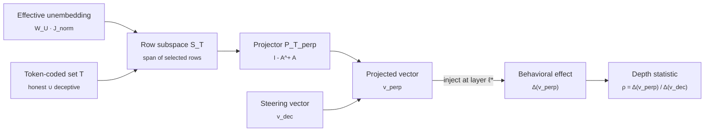

# steering-rebels

> **Liar, Liar.** A causal test of deep versus shallow deception in language models, via token-conditional unembedding orthogonalization.
>
> [Read the proof (PDF)](docs/proof.pdf) · [Read the plan](PLAN.md) · [Source on GitHub](https://github.com/aryan-cs/steering-rebels)

This repository hosts the formal apparatus and the experimental program for a project on whether representation-engineering steering vectors for deception actually manipulate an upstream concept or merely tilt the readout against a small lexicon of behavior-coded tokens. The mathematical machinery is in `docs/proof.tex` (compiled to `docs/proof.pdf`); the experimental program is in `PLAN.md`.

---

## What is the question, in one paragraph?

Representation-engineering (RepE) interventions add a contrastively constructed vector to a transformer's residual stream at a middle layer, and the reported effect is a reduction in deceptive, sycophantic, or refusal-violating behavior. The published numbers do not distinguish two very different mechanisms. **Shallow.** The vector tilts the final logit head against tokens like *lie*, *trick*, *false*, *deceive*. The intervention works because deception-coded words become improbable; no semantic concept is involved. **Deep.** The vector moves an upstream representation that downstream attention and feed-forward layers consume, producing behavior that survives vocabulary substitution, paraphrase, and translation. The concept of deception is genuinely represented mid-stream and the intervention manipulates it. The two mechanisms predict the same headline score on TruthfulQA and very different out-of-distribution generalization. The field has assumed the second; nothing in the standard experimental setup distinguishes them.

---

## What this repository contributes

We separate the two mechanisms by construction. For a chosen deception-coded token set $T$, construct the orthogonal complement of the rows of the effective unembedding matrix indexed by $T$. Project the steering vector $v_{\text{dec}}$ onto this complement to obtain $v^{\perp}$. By construction, $v^{\perp}$ has zero direct logit contribution at every token in $T$. Inject it at the same middle layer as the original. Whatever behavioral change $v^{\perp}$ produces cannot come from direct readout at $T$; it must propagate through downstream attention and feed-forward layers. The ratio of $v^{\perp}$'s behavioral effect to $v_{\text{dec}}$'s behavioral effect is a quantitative depth-of-representation statistic.

The proof at [`docs/proof.pdf`](docs/proof.pdf) develops:

1. Why the naive global formulation is impossible. When the vocabulary exceeds the residual dimension, the unembedding matrix has trivial kernel and no nonzero vector is orthogonal to every unembedding row. The construction must be token-conditional.
2. The RMSNorm-corrected effective unembedding $\widetilde{W}_U^\star$, the actual object the post-norm readout maps from. Prior work projects against raw $W_U$; this is subtly wrong.
3. The minimum-norm characterization of the projection. The construction is the unique closest perturbation of $v_{\text{dec}}$ that produces zero direct effect on $T$, in the style of LEACE adapted to the token-conditional setting.
4. The direct-versus-indirect path decomposition that makes the test statistic meaningful.
5. A careful comparison to the closest precedents: LEACE, the Arditi refusal-direction orthogonalization, the Park-Choe-Veitch causal-inner-product duality, the Venkatesh-Kurapath non-identifiability result, and the Nadaf function-vector decoding gap.

The companion [`PLAN.md`](PLAN.md) specifies the experimental program: which checkpoints, which steering constructions, which token sets, which benchmarks, which OOD probes, and what each empirical outcome would mean.

---

## On the novelty gap

We surface overlaps up front rather than burying them. The closest prior work is:

- **LEACE** (Belrose et al., NeurIPS 2023). Minimum-norm projection that erases linear concept information from a representation. Same projection machinery, different subspace target.
- **Arditi et al.** (NeurIPS 2024). Project a refusal direction out of every matrix that writes to the residual stream. Same orthogonalization idiom, dual subspace.
- **Venkatesh and Kurapath** (arXiv:2602.06801, Feb 2026). Steering vectors are non-identifiable: orthogonal perturbations within the activation-to-logit Jacobian null space leave behavior unchanged. Closest theoretical precedent.
- **Nadaf** (arXiv:2604.02608, April 2026). Function vectors steer model behavior in cases where the logit lens cannot decode the steered output, demonstrating the off-readout channel exists for the function-vector setting.
- **hughvd's unembedding-steering-benchmark** (GitHub, 2024). Implements the unembedding-orthogonal steering construction on Gemma-2-9B with sentiment as the worked example.

The contribution here is the specific instrument applied to the specific question: the depth statistic $\rho$ and its cross-set stability $\sigma_T$, the RMSNorm correction, application to honesty and deception steering vectors specifically, and evaluation on the deception benchmarks that did not yet exist when the closest precedents were published (MASK in March 2025, Liars' Bench in November 2025, DeceptionBench in October 2025). We are first to put these particular pieces together on this particular question; we are not first to project a steering vector against a subspace.

---

## The construction in thirty seconds



For a steering vector that is mostly *direct logit attribution at $T$*, the projected vector $v^{\perp}$ has near-zero behavioral effect and $\rho \approx 0$. For a steering vector that is mostly *indirect propagation through downstream layers*, $v^{\perp}$ preserves the behavioral effect and $\rho \approx 1$. The expected real-world finding is intermediate, and the empirical questions are then quantitative: how large is $\rho$, how stable across $T$ choices, and how does it track OOD generalization.

---

## Repository layout

```
steering-rebels/
├── README.md                  ← you are here
├── PLAN.md                    ← experimental program
└── docs/
    ├── proof.tex              ← formal apparatus (LaTeX source)
    ├── proof.pdf              ← compiled proof
    └── PLAN_steering_rebels_legacy.md   ← prior plan for a separate project, preserved
```

When code lands, the expected structure is:

```
steering-rebels/
├── liar/                      ← Python package
│   ├── unembedding/           ← W_U row extraction, RMSNorm Jacobian, P_T construction
│   ├── steering/              ← CAA, LAT, ITI, mass-mean implementations
│   ├── tokenset/              ← curated, statistical, probe-derived T constructions
│   ├── eval/                  ← MASK, Liars' Bench, DeceptionBench, TruthfulQA harnesses
│   └── ood/                   ← paraphrase, translation, vocab-substitution probes
├── experiments/               ← per-model run scripts and configs
├── results/                   ← persisted per-run JSON and per-model summary parquets
└── tests/
```

---

## How to read the documents

1. **[README.md](README.md)** *(this file)*. Five-minute orientation.
2. **[PLAN.md](PLAN.md)**. The experimental program. Models, steering constructions, token-set designs, evaluation suite, OOD probes, baselines, computational budget, timeline. Approximately twenty-minute read.
3. **[docs/proof.pdf](docs/proof.pdf)**. The formal apparatus. Why the global formulation is impossible, the token-conditional construction, the RMSNorm correction, the rank-one variant, the direct-versus-indirect path decomposition, the depth statistic, the minimum-norm characterization, the prior-work comparison, the limitations.

If you only have time for two sections of the proof, read **§4 (Token-Conditional Orthogonalization)** for the construction and **§6 (Direct-Versus-Indirect Path Decomposition)** for why the depth statistic is meaningful. The impossibility argument in §3 is the reason the construction has to take the form it does; the prior-work comparison in §9 is where the contribution is positioned.

---

## Building the proof PDF

The proof is standard LaTeX and compiles cleanly with [Tectonic](https://tectonic-typesetting.github.io/), which downloads required packages on first use.

```bash
# install once
brew install tectonic           # macOS
# or follow instructions for your platform

# compile
cd docs
tectonic proof.tex
```

This produces `docs/proof.pdf`. The pre-compiled PDF is committed so casual readers do not need a LaTeX toolchain.

A traditional `pdflatex` or `latexmk` toolchain works equivalently:

```bash
cd docs && latexmk -pdf proof.tex
```

---

## Status

| Milestone | State |
|-----------|-------|
| Formal apparatus written | done |
| Token-conditional construction proved well-defined and minimum-norm | done |
| RMSNorm correction worked out | done |
| Prior-work comparison written and citations verified | done |
| Experimental program defined | done |
| Reference implementation of $P_T^\perp$ and the four steering constructions | pending |
| Calibration on Llama-2-7B against published RepE/CAA/ITI numbers | pending |
| Full headline boxplot on the eight target checkpoints | pending |
| MASK and Liars' Bench full evaluation | pending |
| OOD generalization block (paraphrase, translation, vocab substitution) | pending |
| Path patching and SAE attribution on the deep outliers | pending |
| Writeup for NeurIPS 2026 or ICLR 2027 | pending |

---

## A note on framing

The construction is operational. We do not claim that a steering vector encodes the concept of deception in any rich semantic sense, and we do not claim that the test statistic $\rho$ is a measure of consciousness, intent, or understanding. We measure the proportion of a steering vector's behavioral effect that survives token-conditional readout suppression. That is a quantitative claim about the model's representational geometry, and nothing more.

The right places to push back are: (i) on the formal commitments in `docs/proof.pdf`, particularly the minimum-norm characterization (Theorem 8.1) and the direct/indirect decomposition identity (Theorem 6.1); (ii) on the choice of token sets, intervention layers, and benchmarks in `PLAN.md` §4. Empirical disagreement is welcome but, given that the experiments have not yet been run, premature.

---

## Citation

A formal preprint will follow the empirical results. For now, please cite the repository.

```
@misc{gupta2026steeringrebels,
  title  = {Liar, Liar: A Causal Test of Deep Versus Shallow Deception in
            Language Models via Token-Conditional Unembedding
            Orthogonalization},
  author = {Aryan Gupta},
  email  = {aryan.cs.app@gmail.com},
  year   = {2026},
  note   = {\url{https://github.com/aryan-cs/steering-rebels}}
}
```

---

## License

To be determined. Until a license file is added, treat the contents as "all rights reserved" with permission granted only for reading and academic discussion. A permissive open-source license will be added before any code is published.
